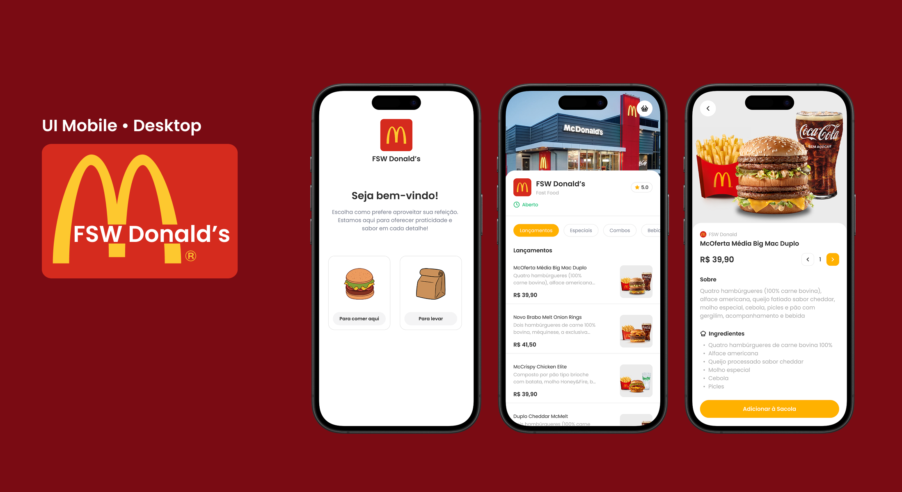

# FullstackWeek-Donalds
### Versão Mobile
<p>
O FullstackWeek-Donalds é um sistema de delivery inspirado no McDonald's. Ele permite que os clientes visualizem o cardápio, incluindo preços e descrições dos produtos, e adicionem itens à sacola para realizar pedidos.
Este projeto foi feito a partir de uma imersão do YouTube no canal Felipe Rocha • Full Stack Club, onde em 5 aulas ao vivo foi desenvolvido este incrível projeto da Full Stack Week do <a href=https://github.com/felipemotarocha> Felipe Mota Rocha</a>.




 ### 🚀 Tecnologias Utilizadas

- Next.js 15.1.6

- React ^19.0.0

- TypeScript ^5

- Prisma ^6.2.1

- Zod ^3.24.2

- @hookform/resolvers ^4.1.2

- Lucide React ^0.475.0

- Tailwind CSS ^3.4.1

- ESLint ^9

- TS-Node ^10.9.2

 ### 💡 Funcionalidades

- Exibição de cardápio com imagens, descrição e preço dos produtos.

- Possibilidade de adicionar e remover itens da sacola.

- Permite que o cliente adicione quantos itens desejar ao carrinho.

- Opção de excluir itens individualmente ou limpar toda a sacola.

- Exibição do valor total da compra em tempo real.

- Possibilidade de cancelar a compra antes da finalização do pedido.

- Resumo do pedido antes da finalização.

- Layout responsivo e moderno utilizando Tailwind CSS.

- Exibição de cardápio com imagens, descrição e preço dos produtos.


 ### 📖 Como Executar o Projeto

#### Pré-requisitos

Node.js e npm instalados.

1. Clone o repositório:

   ```bash
     https://github.com/DevGabrielrr/Donalds-fullstackweek.git
   ```

2. Navegue até o diretório do projeto:

   ```bash
   cd nome-do-repositorio
   ```

3. Atualize o projeto, Em seu terminal e na pasta do projeto

   ```bash
   npm install
   ```

4. Rodar o projeto

   ```bash
   npm run dev
   ```
5. Ao rodar o projeto use

   ```bash
    http://localhost:3000/fsw-donalds 
    ```
